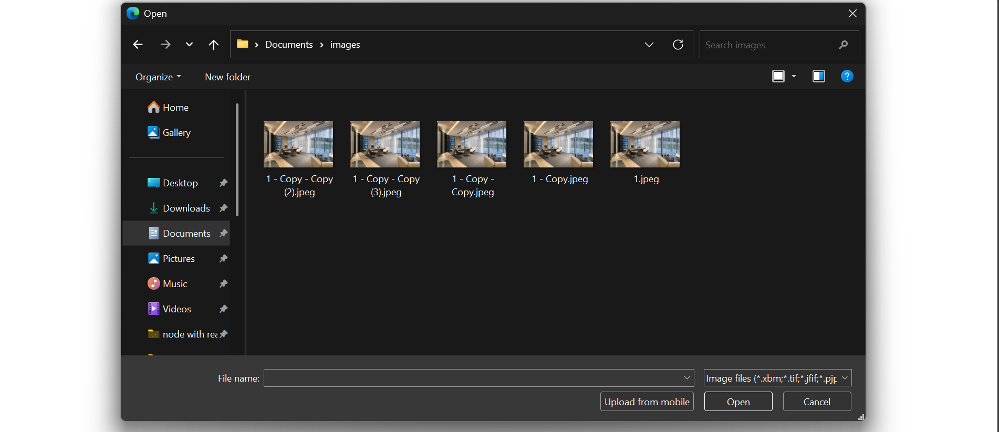
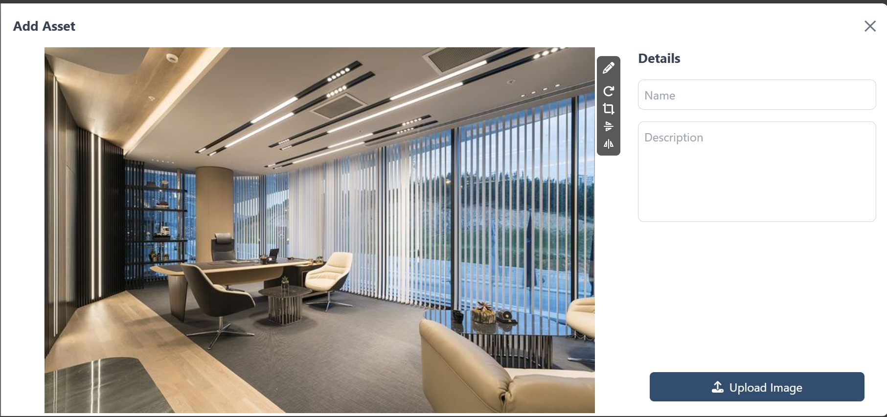

# Image Upload Drawer

A React application that allows users to upload images and perform basic image operations (rotate, flip, crop) using an intuitive drawer interface.

## Features

- Upload images to ImgBB API
- Image preview and editing options (rotate, flip, crop)
- Responsive UI with Material-UI and custom styles

## Installation

1. Clone the repository.
2. Install dependencies:
   ```bash
   npm install
   ```
   
   
   
  
